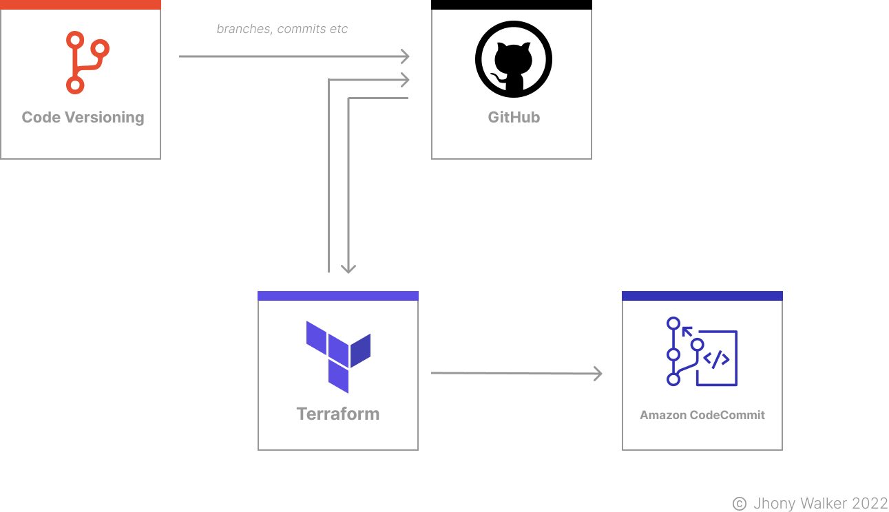

This Terraform script works in the following situation: we have our private Github organization where the project code is stored and we need to sync it with another repository in AWS CodeCommit. For those unfamiliar with AWS CodeCommit is a highly scalable, secure managed source control service that hosts private Git repositories within the AWS ecosystem.

## How to use

- [ ] Create a personal access token on Github (if you don't know how, just [access here](https://docs.github.com/en/authentication/keeping-your-account-and-data-secure/creating-a-personal-access-token))
- [ ] Clone this repository
- [ ] Generate an SSH key
- [ ] Substitute the appropriate values below which are located in the file `terraform.tfvars`:

```
github_token               = "PUT YOUR GITHUB PERSONAL ACCESS TOKEN HERE"

aws_access_key_id          = "PUT AWS SECRET ACCESS KEY ID HERE"
aws_secret_access_key      = "PUT AWS SECRET ACCESS KEY HERE"

github_repository_name     = "Github Repository Name e.g. 'samplegithubrepo'"
codecommit_repository_name = "CodeCommit Repository Name e.g. 'samplecodecommitrepo'"

ssh_private_key_path       = "PUT THE PATH WHERE SSH PRIVATE KEY IS STORED e.g. ~/.ssh/id_rsa"
ssh_public_key_path        = "PUT THE PATH WHERE SSH PUBLIC KEY IS STORED e.g. ~/.ssh/id_rsa.pub"

aws_region                 = "PUT YOUR AWS REGION OF CHOICE"
```

- [ ] Run the command `terraform init`
- [ ] Run the command `terraform apply`
- [ ] Check the features to be deployed make sense and type "yes" to deploy the features.

## Architecture

<h1 align="center">
    
</h1>

## Technologies

<div align="center">

| Language                               |
| -------------------------------------- |
| HCL (HashiCorp Configuration Language) |

</div>

## Contributions

- [ ] Fork this repository;
- [ ] Create a branch with your feature: `git checkout -b my-feature`;
- [ ] Commit your changes: `git commit -m 'feat: My new feature'`;
- [ ] Push to your branch: `git push origin my-feature`.

## License

The MIT license, also called the X license or the X11 license, is a computer program license created by the Massachusetts Institute of Technology. It is a permissive license used in both free software and proprietary software.
